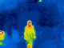
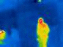
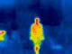
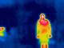

# Fall Detection with Co-occurrence-Feature-Learning-From-Skeleton-2D-Data
***
此專案是針對一連串人體的骨幹座標(frames)變化來偵測人體的目前動作的 CNN，訓練資料來自 [SBU_dataset](https://www3.cs.stonybrook.edu/~kyun/research/kinect_interaction/index.html) 以及我自行利用拍攝好的照片經過 [openpose](https://github.com/CMU-Perceptual-Computing-Lab/openpose) 得出人體骨幹座標的資料
***
## Detail
-This is a project implemented with Keras based on the code from [here](https://github.com/fandulu/Keras-for-Co-occurrence-Feature-Learning-from-Skeleton-Data-for-Action-Recognition), [relative paper](https://arxiv.org/abs/1804.06055).

-Training and Testing data is in [data_seq dirctory](https://github.com/LinShien/Fall_Detection_Project/tree/master/data_seq).

-The whole model is defined in [model.py](https://github.com/LinShien/Fall_Detection_Project/blob/master/model.py).

-Addtional data-processing code is in [utils.py](https://github.com/LinShien/Fall_Detection_Project).

-To test the model, use [fall_detection.py](https://github.com/LinShien/Fall_Detection_Project/blob/master/fall_detection.py).

且部分資料由熱成像圖轉換成座標圖來做訓練，如下 :

class 9

class 10

## Result
Train with 416 skeleton sequences (20 frames)

Test with 83 skeleton sequences (20 frames)

Training acc : 100 %

Testing acc  : 94 %
